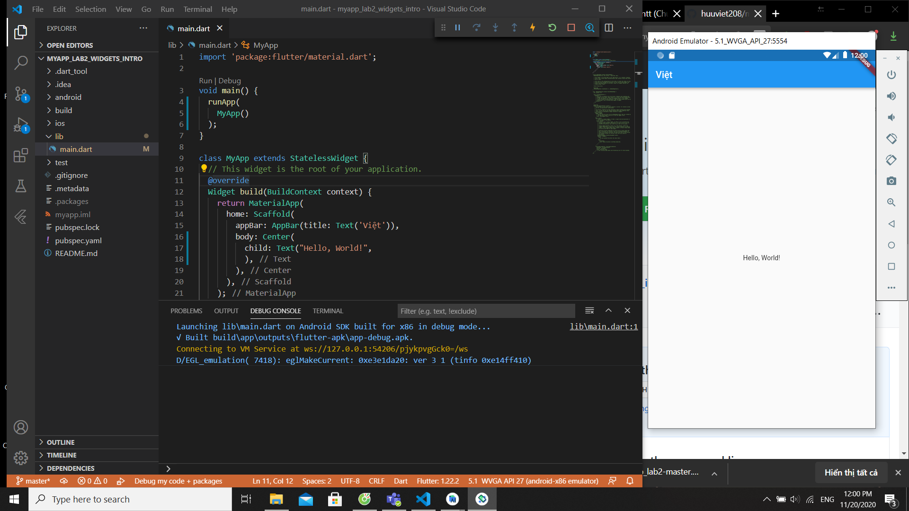
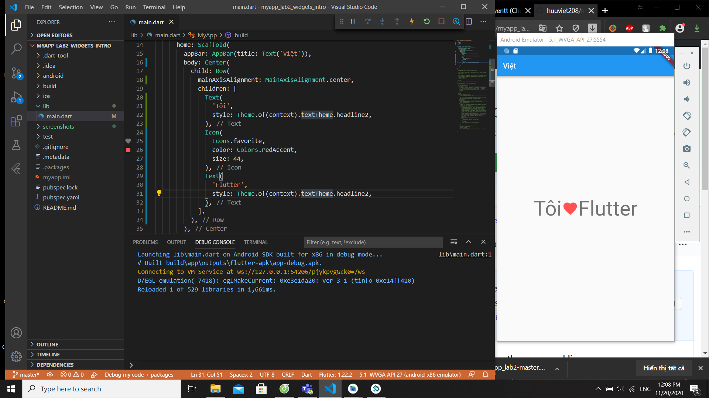
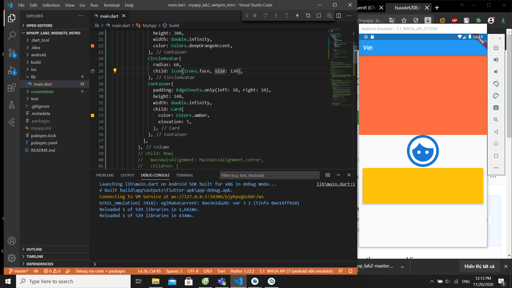
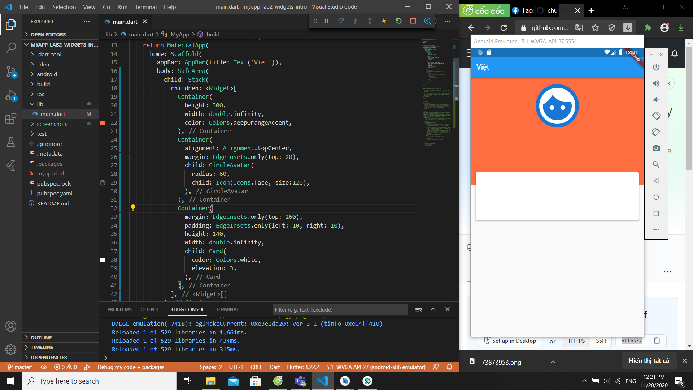
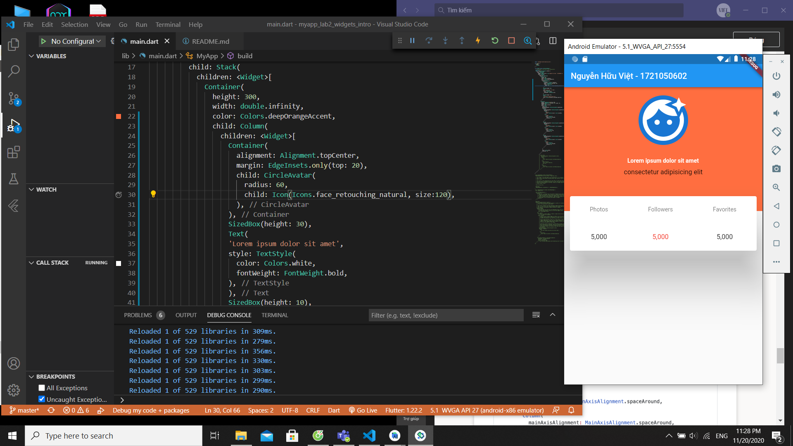
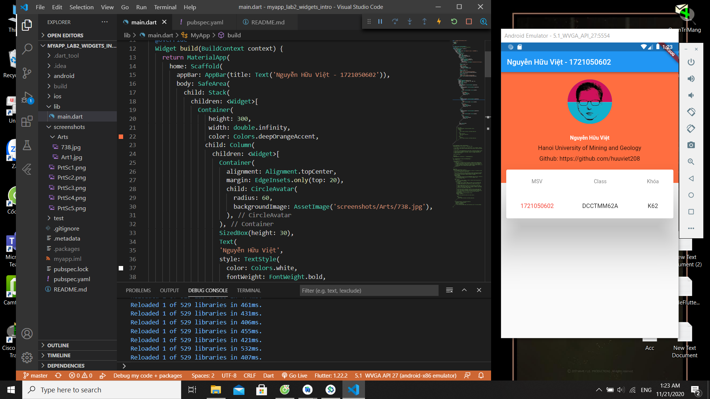

# myapp

### "Hello, World!":

### Row:

### Card & CircleAvatar:

### Stack:

### Đưa Container chứa CircleAvatar vào Widget Column, sau đó chèn thêm một số widgets vào Column:

### Thêm Avatar:

